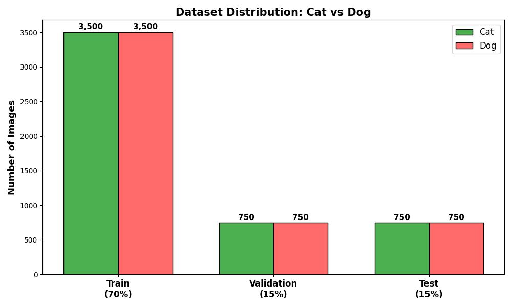
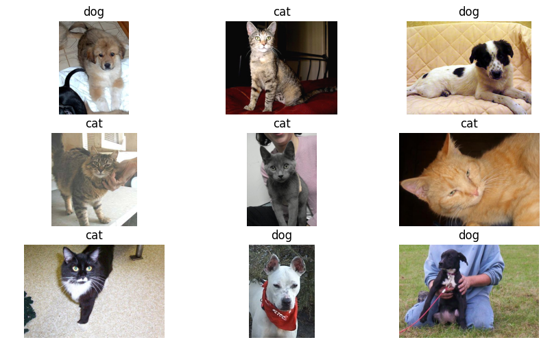
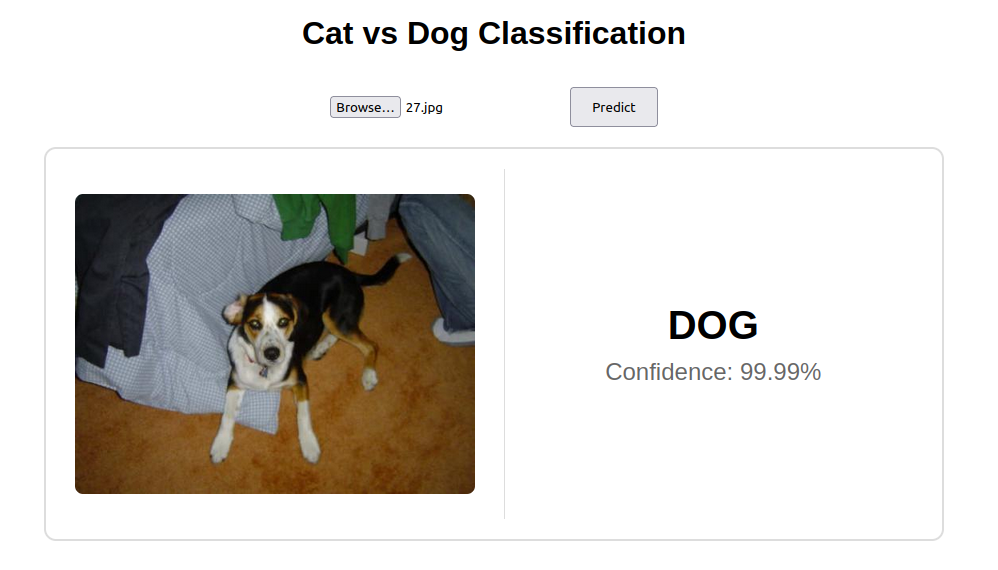

# 🐱🐶 Cat and Dog Image Classification

A deep learning project for binary image classification (cat vs dog) using ResNet-18 with transfer learning. The project includes training pipeline, evaluation metrics, and a web API for inference.

## Overview
This project implements a **Cat vs Dog** image classifier using:
- **ResNet-18** pretrained on ImageNet (frozen backbone)
- **Transfer learning** with custom classifier head
- **PyTorch Lightning** for structured training
- **FastAPI** for web deployment

### Key Features
- 🚀 Transfer learning for fast training
- 📊 Comprehensive evaluation metrics (Accuracy, F1, Precision, Recall)
- 🖼️ Multiple inference options (CLI, batch, web API)
- 📈 Early stopping & model checkpointing
- 🔄 Data augmentation with Albumentations

## Environment Setup
### Requirements
- Python 3.10
- CUDA 11.8 (optional, for GPU training)

### Installation
#### Option 1: Using Conda (Recommended)
```bash
# Create environment
conda create -n dogcat python=3.10
conda activate dogcat
pip install -r requirements.txt
```
#### Option 2: Using venv
```bash
# Create virtual environment
python -m venv venv
source venv/bin/activate  # Linux/Mac
# venv\Scripts\activate  # Windows
pip install -r requirements.txt
```

## Dataset
**Dataset Source:** [Cat and Dog dataset on Kaggle](https://www.kaggle.com/datasets/bhavikjikadara/dog-and-cat-classification-dataset) (original, 25,000 images)

**Pre-processing:**
- Randomly sampled 5,000 images from each class, resulting in a balanced dataset of 10,000 images.
- Split the dataset into training (70%), validation (15%), and test (15%) subsets.

**Processed dataset (optional):** Available on [my Kaggle](https://www.kaggle.com/datasets/nguyenquan1123/dogs-cats-10k)

**Dataset Distribution:** Number of images per class in each dataset split.


Some sample images from the dataset are shown below, illustrating the visual characteristics of the Cat and Dog classes.

## 🚀 Run Inference
Run prediction on a single image:
```bash
python transfer_learning/predict.py --image_path "path/to/image.jpg"
```

## 🌐 Run Web Application
The FastAPI-based web application has been successfully deployed and is publicly accessible at:
👉 [Live Demo](https://quan12012-cat-dog-classification.hf.space)

The application allows users to upload an image and returns the predicted class (Cat or Dog) along with the corresponding confidence score.

Once the server is running locally, it can also be started using:
```bash
python -m uvicorn app:app --reload
```
Then access it via:
```
http://127.0.0.1:8000
```
## 🖥️ Web Interface
The web interface enables users to upload an image and obtain the predicted class together with the confidence score. The interface also provides a visual preview of the uploaded image to improve usability.



